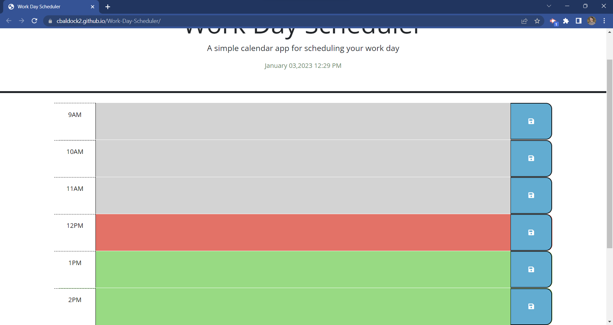

# Work-Day-Scheduler

## Description
The Workday Scheduler is a daily planner. It starts at the hour of 9AM and has a text box for every hour until the end of the workday, 5PM. Depending on the hour the input area will be colored different. If the time has past, the color of the box will be gray. If it is the current hour, the color is red. Lastly if the time is in the future, the color is green.

## Installation
N/A

## Usage
In the text box the user can enter anything from "1PM: Meeting with Jordan" to "9AM: Go on a jog". If the user saves the input, click the blue save button, the users input will be recorded to the local storage. Each save button saves each individual time block input. If the user refreshes the page the input will still be displayed in the box that it was saved in. For the time block to be emptied after saving the user needs to delete the input and save the empty input to the local storage.

## Credits
N/A

## Link
<a href="https://cbaldock2.github.io/Work-Day-Scheduler/">Work Day Scheduler</a>

## Screenshots

## License
Please refer to the LICENSE in the repo.